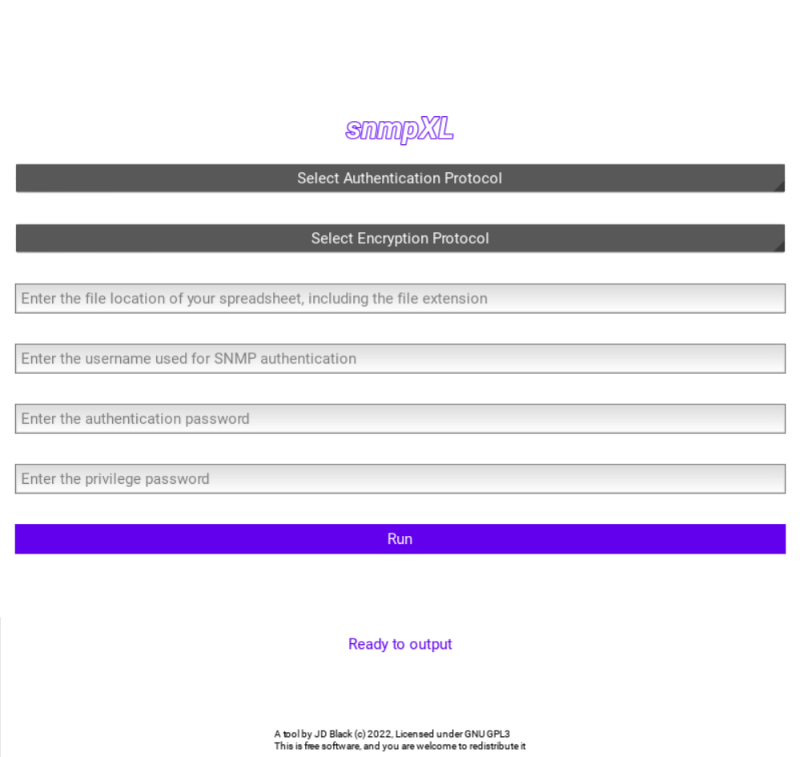

# *What does this software do?*
snmpXL allows the user to get large amounts of SNMPv3 data relatively easy. It gets information from an excel spreadsheet,
queries network devices based on that info, and writes the result back to the spreadsheet.

# *How do I use it?*
Open up the template.xlsx file included in the repo. Fill in the IP and MIB information for each MIB desired.
If devices do not share credentials, they can be individually specified in the spreadsheet. Then run snmpXL with the included shortcut
and specify the needed information. If you filled out the username and passwords in the spreadsheet, leave the fields blank.

# *Who is this for?*
You are most likely to find this useful if you are rolling out SNMPv3 to a large amount of network devices.

# *Should I use this for something important?*
This software is licensed under GPL3, so use it as you like. 
But I'm just an intern so use this code at your own risk.

Screenshot:

